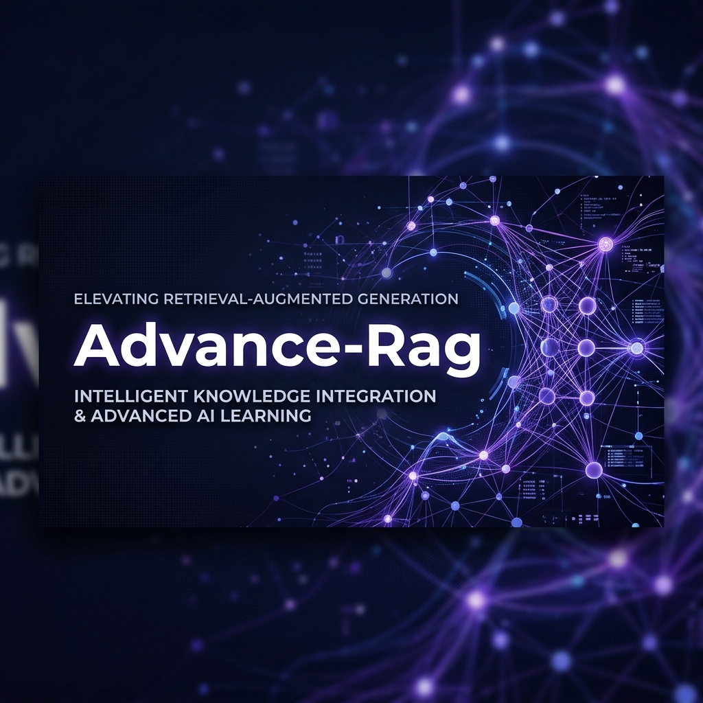
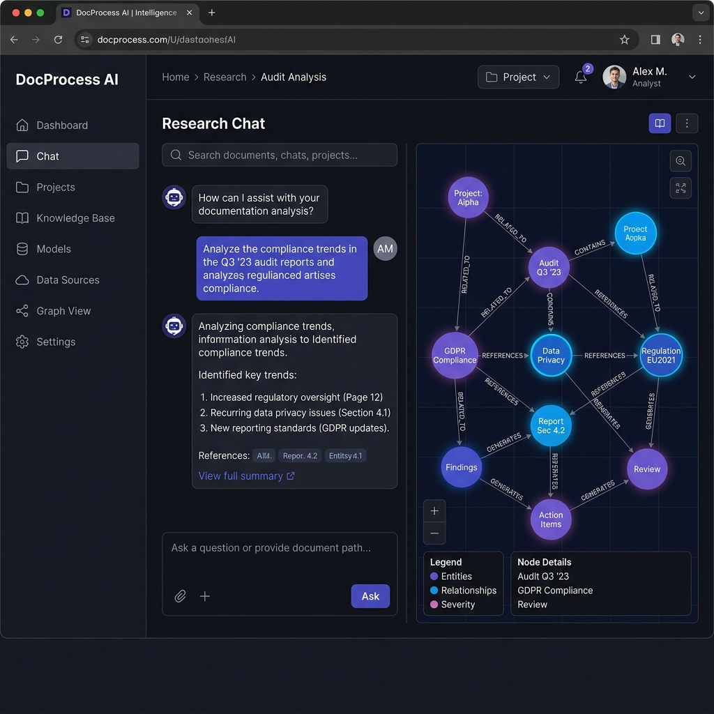
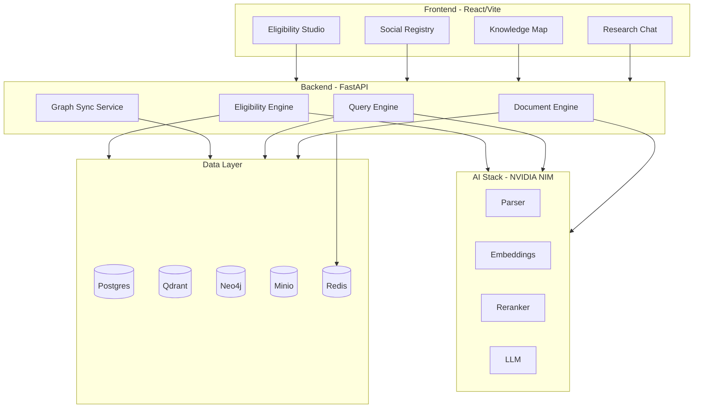

<div align="center">
  

  # 🚀 Advance-Rag

  **Full-stack Intelligence Platform combining Document RAG, Neo4j Knowledge Graphs, and Fraud-Intelligence Workflows.**

  [](LICENSE)
  [](https://www.python.org/)
  [](https://www.nvidia.com/en-us/ai-data-science/generative-ai/nim/)
  [](https://neo4j.com/)

  [Features](#-key-features) • [Architecture](#-architecture) • [Quick Start](#-quick-start) • [Documentation](#-documentation)
</div>

---

## 📖 Overview

Advance-Rag is not just another RAG application. It is a unified platform designed to solve complex intelligence problems by bridging the gap between **unstructured documents** and **structured registry data**.

> [!IMPORTANT]
> The system enables teams to ask grounded research questions over PDFs while simultaneously detecting fraud patterns, ghosts, and anomalies in connected citizen records.

---

## ✨ Key Features

| Feature | Description | Tech |
| :--- | :--- | :--- |
| **🔍 Research Chat** | Grounded Q&A with precise citations over uploaded document sets. | Qdrant, NVIDIA NIM |
| **🕸️ Knowledge Map** | Visual exploration of document entities and registry relationships. | Neo4j, React-Force-Graph |
| **📊 Social Registry** | Dashboard for fraud detection, audit prioritization, and risk clusters. | Postgres, FastAPI |
| **⚖️ Eligibility Studio** | Automated extraction of policy rules and citizen evaluation. | LLM, Document Parsing |

---

## 🖼️ Platform Preview

<div align="center">
  
  <p><i>A unified view of Knowledge Graphs and Document Intelligence</i></p>
</div>

---

## 🏗️ Architecture

The platform follows a modern microservices architecture powered by the NVIDIA AI stack.



---

## 🚀 Quick Start

<details>
<summary><b>1. Prerequisites</b></summary>

- Python 3.12+ & `uv`
- Node.js 18+ & `pnpm`
- Docker + Docker Compose
- NVIDIA NIM API Key ([NemoRetriever OCR](https://build.nvidia.com/nvidia/nemoretriever-ocr-v1))
</details>

<details>
<summary><b>2. Environment Setup</b></summary>

```bash
# Copy template
cp .env.example .env

# Configure your keys in .env
# NVIDIA_API_KEY=your_key_here
```
</details>

<details>
<summary><b>3. Launching the App</b></summary>

```bash
# Install everything
make setup

# Start the full stack
make start
```
</details>

### 🌐 Default Endpoints

- **Frontend**: [http://localhost:5177](http://localhost:5177)
- **API Docs**: [http://localhost:8081/docs](http://localhost:8081/docs)
- **Neo4j Console**: [http://localhost:7474](http://localhost:7474)

---

## 🛠️ Project Structure

```text
├── backend/          # FastAPI, UV, SQLModel
├── frontend/         # React, Vite, shadcn/ui
├── docs/             # Technical deep-dives
├── assets/           # Visual media and banners
└── infra/            # Docker configurations
```

---

## 📚 Documentation

Deep dive into the core mechanics:

- 📑 [Master Pipeline Flow](docs/MASTER_PIPELINE_FLOW_DIAGRAM.md)
- 🕸️ [Knowledge Graph Guide](docs/KNOWLEDGE_GRAPH_GUIDE.md)
- 🎯 [Fraud Intelligence Presentation](docs/KG_FRAUD_INTELLIGENCE_PRESENTATION_GUIDE.md)
- 📝 [Eligibility Layman Brief](docs/USE_CASE_3_LAYMAN_BRIEF.md)
- 🗃️ [Database Curation](docs/DATABASE_CURATION.md)

---

<div align="center">
  <p>Built for scale and intelligence. Optimized for NVIDIA NIM.</p>
</div>
