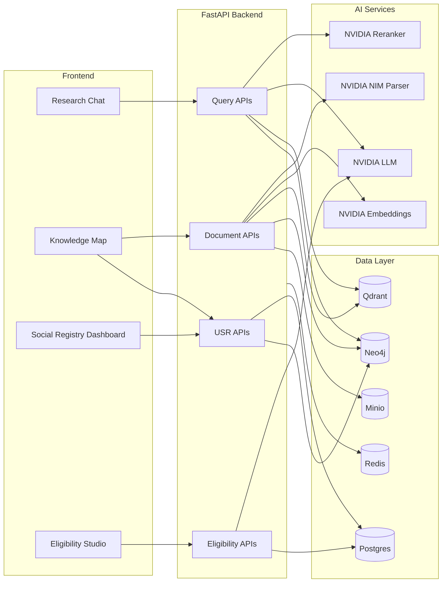
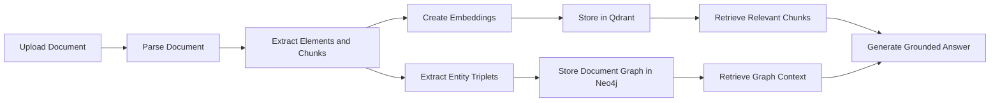
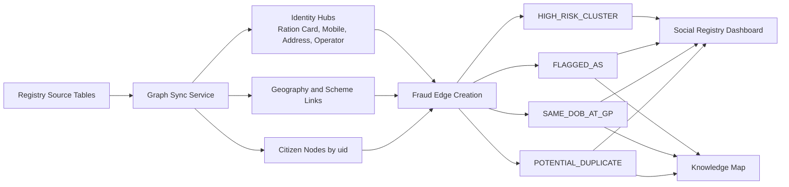

# Advance-Rag

Advance-Rag is a full-stack intelligence platform that combines document RAG, a Neo4j knowledge graph, a Unified Social Registry fraud-intelligence workflow, and policy-based eligibility evaluation.

In simple terms, the system does two big jobs:

- it lets users upload documents and ask grounded research questions over them
- it turns structured welfare registry data into a connected graph for fraud detection, explainability, and audit prioritization

## What This Project Solves

Most systems handle these problems separately:

- document search lives in one tool
- fraud review lives in dashboards and spreadsheets
- policy eligibility logic lives in PDFs and manual interpretation

Advance-Rag brings them together into one application so teams can:

- ingest documents and query them with citations
- build a document graph from extracted entities and relationships
- sync social-registry data into a fraud-intelligence graph
- detect duplicate, ghost, and anomaly patterns across connected records
- extract eligibility criteria from policy documents
- evaluate citizens against structured inclusion and exclusion rules

## Main Product Areas

- `Research Chat`
  Grounded Q&A over uploaded documents using chunking, embeddings, reranking, and answer generation.

- `Knowledge Map`
  Graph visualization over both document-extracted entities and the USR fraud-intelligence graph.

- `Social Registry Dashboard`
  Registry-wide fraud, anomaly, risk, audit, and operator-intelligence views.

- `Eligibility Studio`
  PDF-to-rule extraction plus citizen-level eligibility evaluation.

## High-Level Architecture



## Two Core Pipelines

This repo has two different but connected intelligence pipelines.

### 1. Document Research Pipeline

Used when a user uploads PDFs or other supported files and asks research questions.



### 2. Unified Social Registry Fraud-Intelligence Pipeline

Used when social-registry data is synced from a configured registry source into Neo4j.



## Tech Stack

- Backend: Python, FastAPI, SQLModel, asyncpg, uv
- Frontend: React, TypeScript, Vite, shadcn/ui, pnpm
- Databases: Postgres, Qdrant, Neo4j, Redis
- Object storage: Minio
- AI stack: NVIDIA NIM parser, embeddings, reranker, and LLM models
- Infra: Docker Compose

## Repository Layout

```text
backend/     FastAPI app, services, routers, tests, utility scripts
frontend/    React/Vite application
docs/        Architecture, graph, and product documentation
logs/        Local runtime logs
plan/        Design notes and execution plans
docker-compose.yml
Makefile
.env.example
```

## Important Data Concepts

### Document Knowledge Graph

The document graph is built from entity triplets extracted from uploaded documents.

- nodes are generic entities like `Person`, `Organization`, `Location`, `Event`, `Concept`
- edges are stored as `:RELATED`
- this graph helps multi-hop RAG and visual knowledge exploration

### USR Fraud-Intelligence Graph

The registry graph is built from structured citizen data and modeled around:

- `Citizen`
- `District`
- `Block`
- `GP`
- `Scheme`
- `RationCard`
- `Mobile`
- `Address`
- `Operator`
- `FraudFlag`

Key relationships include:

- `RESIDES_IN`
- `PART_OF`
- `ENROLLED_IN`
- `MEMBER_OF`
- `HAS_MOBILE`
- `REGISTERED_BY`
- `LIVES_AT`
- `POTENTIAL_DUPLICATE`
- `SAME_DOB_AT_GP`
- `FLAGGED_AS`
- `HIGH_RISK_CLUSTER`

## Identity and De-duplication Model

The current system treats `uid` as the canonical citizen key during graph sync.

- one `Citizen` node is created per `uid`
- repeated source rows with the same `uid` merge into the same graph citizen
- different `uid` values are not auto-merged into one citizen node

Instead, suspicious duplication is represented as graph evidence:

- `POTENTIAL_DUPLICATE`
  created for suspicious duplicate pairs

- `SAME_DOB_AT_GP`
  created for same-DOB cluster behavior at the GP level

- `FLAGGED_AS`
  used for ghost, anomaly, and data-quality flags

This is important: the graph preserves traceability. It flags suspicious identity overlap instead of silently collapsing people together.

## Eligibility Workflow

Eligibility Studio supports a policy-to-decision flow:

1. upload a scheme document
2. parse and extract eligibility metadata
3. store inclusion and exclusion conditions
4. evaluate registry citizens against those rules
5. mark outcomes such as eligible, ineligible, or review required

This gives the project both intelligence and actionability:

- the graph explains suspicious cases
- the eligibility engine explains benefit decisions

## Local Development Setup

### Prerequisites

- Python 3.12+
- Node.js 18+
- Docker + Docker Compose
- `uv`
- `pnpm`
- NVIDIA NIM API key

### Environment

Copy the template:

```bash
cp .env.example .env
```

Then fill in required values, especially:

- `NVIDIA_API_KEY`
- any password overrides you want for local infra
- port overrides if your machine is already using defaults

Note:

- root `.env` is for the main local app stack
- `frontend/.env` can be used for frontend-specific overrides when needed

## Running the Project

### Install Dependencies

```bash
make setup
```

### Start Infrastructure Only

```bash
make up
```

### Start the Main Local Development Stack

```bash
make start
```

### Stop Everything

```bash
make stop
```

## Common Commands

Infrastructure:

```bash
make up
make down
make nuke
make ps
make health
```

Backend:

```bash
make backend-setup
make backend-start
make backend-stop
make logs-backend
```

Frontend:

```bash
make frontend-setup
make frontend-start
make frontend-stop
make frontend-preview
make logs-frontend
```

Full app:

```bash
make setup
make start
make stop
make restart
make logs
```

## Default Local Endpoints

In the current Makefile-based local flow:

- Frontend: `http://127.0.0.1:5177`
- Backend API: `http://127.0.0.1:8081`
- Backend OpenAPI docs: `http://127.0.0.1:8081/docs`
- Neo4j Browser: `http://127.0.0.1:7474`
- Minio Console: `http://127.0.0.1:9091`
- Qdrant: `http://127.0.0.1:6343`
- Postgres: `127.0.0.1:5434`

## Key Backend Areas

- `backend/src/routers/documents.py`
  document upload, graph retrieval, deletion

- `backend/src/routers/query.py`
  research query flow and graph-enriched answering

- `backend/src/routers/usr.py`
  social-registry APIs, graph stats, audit and fraud endpoints

- `backend/src/routers/eligibility.py`
  rule extraction and eligibility evaluation APIs

- `backend/src/services/graph_sync.py`
  registry-to-Neo4j sync plus fraud-edge creation

- `backend/src/services/graph_db.py`
  graph retrieval, graph context search, and citizen graph snapshots

- `backend/src/services/eligibility.py`
  extracted-rule interpretation and decision logic

## Key Frontend Areas

- `frontend/src/App.tsx`
  main workspace shell, research chat, knowledge map

- `frontend/src/components/UsrDashboard.tsx`
  fraud-intelligence and audit dashboard

- `frontend/src/components/EligibilityStudio.tsx`
  eligibility workflow UI

## Testing and Validation

Backend tests:

```bash
cd backend
uv run pytest -s
```

Frontend production build:

```bash
cd frontend
pnpm build
```

Backend formatting:

```bash
cd backend
uv run black src tests
uv run isort src tests
```

## Documentation

Useful deeper references in [`docs/`](/home/pulkitv52/Advance-rag/docs):

- [MASTER_PIPELINE_FLOW_DIAGRAM.md](/home/pulkitv52/Advance-rag/docs/MASTER_PIPELINE_FLOW_DIAGRAM.md)
- [KNOWLEDGE_GRAPH_GUIDE.md](/home/pulkitv52/Advance-rag/docs/KNOWLEDGE_GRAPH_GUIDE.md)
- [KG_FRAUD_INTELLIGENCE_PRESENTATION_GUIDE.md](/home/pulkitv52/Advance-rag/docs/KG_FRAUD_INTELLIGENCE_PRESENTATION_GUIDE.md)
- [USE_CASE_3_LAYMAN_BRIEF.md](/home/pulkitv52/Advance-rag/docs/USE_CASE_3_LAYMAN_BRIEF.md)

## Current Reality

This repo is not just a generic RAG app.

It is a combined platform for:

- document intelligence
- graph intelligence
- fraud detection support
- explainability
- eligibility automation

That combination is what makes Advance-Rag valuable, and the README should help a new engineer or reviewer understand that quickly.
