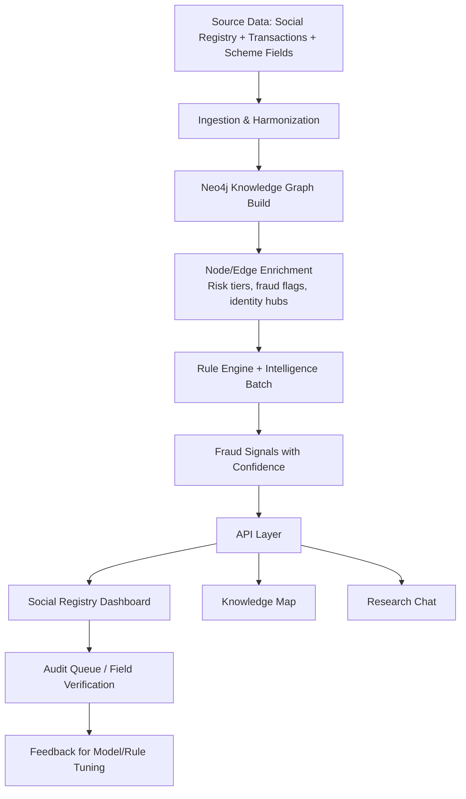
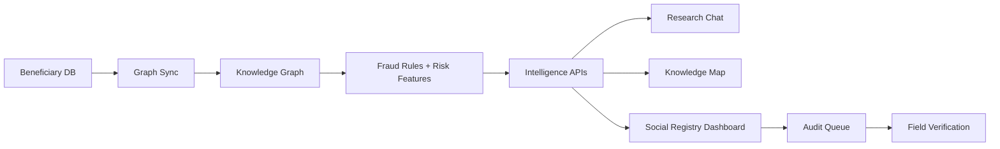

# Knowledge Graph for Fraud Intelligence

Presentation Guide for Advance-RAG  
Scope: Research Chat + Knowledge Map + Social Registry Dashboard

---

## Data Source Clarification (Use this in slides)

There are two parallel data tracks in the platform:

- **Unstructured track**
  - input: uploaded PDFs/documents
  - powers: Research Chat + Document Knowledge Map
  - value: semantic retrieval, narrative analysis, document-grounded Q&A

- **Structured track**
  - input: `srsdb.dump` restored to PostgreSQL, then synced to Neo4j
  - powers: Social Registry Dashboard + USR fraud endpoints
  - value: fraud risk analysis, alerting, triage, and audit prioritization

For fraud intelligence presentation, emphasize that the current backbone is primarily the **structured track**.

---

## 1. Executive Summary

The Knowledge Graph (KG) is the core intelligence layer that connects fragmented beneficiary records into explainable risk networks.  
It does not replace business rules or ML; it amplifies both by adding relationship context:

- who is connected to whom
- through which identity hubs
- with what fraud signals
- and at what confidence

In simple terms:

- **Without KG:** fraud checks are isolated row-level filters.
- **With KG:** fraud becomes a network problem with evidence paths and auditable decisions.

---

## 2. Why a Knowledge Graph is Critical for Fraud Analysis

Fraud in social protection systems is rarely a single bad field. It usually appears as patterns across entities:

- many identities sharing one mobile/ration card/operator
- duplicate or near-duplicate identities across locations
- suspicious concentration in certain GPs/schemes
- repeated anomalies around specific registration hubs

A relational table can find some of these with heavy joins, but it struggles with:

- multi-hop relationship reasoning
- explainability paths for investigators
- real-time neighborhood inspection
- combining structural + semantic + risk evidence

The KG solves this by storing both **entities** and **relationships** as first-class citizens.

---

## 3. Product Modules and Their Roles

The product has 3 user-facing intelligence surfaces:

## 3.1 Research Chat (Primary data: Unstructured documents)

- user asks natural-language questions
- backend retrieves document/vector context + graph context
- generates grounded analytical responses
- useful for policy/research exploration and narrative intelligence

Role in fraud program:

- supports analyst reasoning and contextual investigation
- converts graph-derived signals into understandable narratives

## 3.2 Knowledge Map (Data mode: Unstructured and/or Structured, based on active graph context)

- visual network of entities and relations
- helps analysts inspect connected clusters, central hubs, and suspicious topology
- supports exploratory investigation and evidence communication

Role in fraud program:

- visual proof of networked risk
- easier identification of fraud rings and shared-identity patterns

## 3.3 Social Registry Dashboard (Primary data: Structured social registry)

- operational command center for USR fraud intelligence
- shows KPIs, top-risk citizens, district risk view, intelligence feed, audit queue
- supports triage, field verification prioritization, and exports

Role in fraud program:

- converts graph signals into actionable audit operations
- prioritizes what to verify first based on confidence/risk signals

---

## 4. End-to-End Flow (Data to Decision)

---

## 5. Graph Data Model Used for Fraud Intelligence

## 5.1 Main node types

- `Citizen`
- `GP`, `Block`, `District`
- `Scheme`
- `FraudFlag`
- Identity hubs:
  - `RationCard`
  - `Mobile`
  - `Operator`
  - `Address`

## 5.2 Important relationship types

- structural:
  - `(:Citizen)-[:RESIDES_IN]->(:GP)`
  - `(:GP)-[:PART_OF]->(:Block)->(:District)`
  - `(:Citizen)-[:ENROLLED_IN]->(:Scheme)`
- fraud/evidence:
  - `POTENTIAL_DUPLICATE`
  - `SAME_DOB_AT_GP`
  - `FLAGGED_AS`
  - `HIGH_RISK_CLUSTER`
- identity hub links:
  - `MEMBER_OF`, `HAS_MOBILE`, `REGISTERED_BY`, `LIVES_AT`

This model allows fraud logic to combine demographic, geographic, scheme, and identity evidence in one connected structure.

---

## 6. How KG Helps “Predict” Fraud (Risk Estimation)

Important framing for presentation:

- Current system is mostly **graph-enhanced risk scoring + rule intelligence**, not purely black-box prediction.
- The KG enables prediction-style outputs by enriching each subject with neighborhood risk features.

Graph-derived predictive features include:

- duplicate edge count
- same-DOB cluster density
- shared mobile/ration-card cluster size
- operator-level anomaly rates
- GP concentration anomalies
- prior flags and confidence history

These features make risk estimation significantly stronger than flat row checks.

---

## 7. Fraud Intelligence Logic (Rule Families)

Current engine combines multiple rule families:

- Ghost detection (age/scheme inconsistencies)
- Duplicate identity detection (exact + fuzzy)
- Scheme anomaly detection (concentration/contradiction patterns)
- Household overload and operator anomaly patterns
- Advanced exploitation signals (e.g., suspicious monetization patterns)
- Data quality checks to reduce false positives

Each signal carries confidence and evidence, enabling explainable triage.

---

## 8. Decision Support and Explainability

The KG provides explainability at 3 levels:

1. **Rule-level explanation**  
   Example: “Flagged as duplicate due to same DOB + high name similarity + same GP.”

2. **Path-level explanation**  
   Example: “Citizen A and Citizen B are linked through shared ration card and operator cluster.”

3. **Context-level explanation**  
   Example: “GP has high concentration of high-risk beneficiaries and repeated anomaly flags.”

This is critical for public-sector use where decisions must be auditable and defensible.

---

## 9. Operational Value by Module

## Research Chat value

- analyst productivity for investigations
- converts complex network evidence into narrative summaries

## Knowledge Map value

- rapid visual fraud-cluster discovery
- better communication with leadership and field teams

## Social Registry Dashboard value

- prioritizes highest-risk cases for field verification
- standardizes audit workflow and exportables (CSV/PDF briefs)

---

## 10. Business and Governance Impact

## 10.1 Program outcomes

- reduced leakage through earlier detection
- better targeting of verification resources
- faster triage and closure of suspicious cases

## 10.2 Governance outcomes

- transparent, explainable decision support
- traceable evidence for audit and compliance
- stronger trust in welfare operations

---

## 11. KPI Framework for Presentation

Use this KPI set in slides:

Detection quality:

- precision of top-N flagged cases
- false-positive rate after field verification
- multi-signal case ratio

Operational:

- mean time to triage
- mean time to closure
- high-severity queue aging

Platform:

- graph refresh latency
- API p95 latency
- batch/incremental run success rate

---

## 12. What to Say in Presentation (Suggested Narrative)

Slide narrative:

1. “We unified fragmented records into a connected beneficiary graph.”
2. “We moved from isolated checks to relationship-driven fraud intelligence.”
3. “The graph powers three user experiences: chat, map, and operations dashboard.”
4. “Each alert is explainable via graph evidence, not opaque scoring.”
5. “This creates a practical path from detection to verified field action.”

---

## 13. Sample Slide-Friendly Architecture Diagram

---

## 14. Key Message to Leadership

The Knowledge Graph is the strategic layer that turns raw welfare data into **explainable fraud intelligence**.  
It improves detection quality, speeds audits, and enables transparent decision-making at scale.
