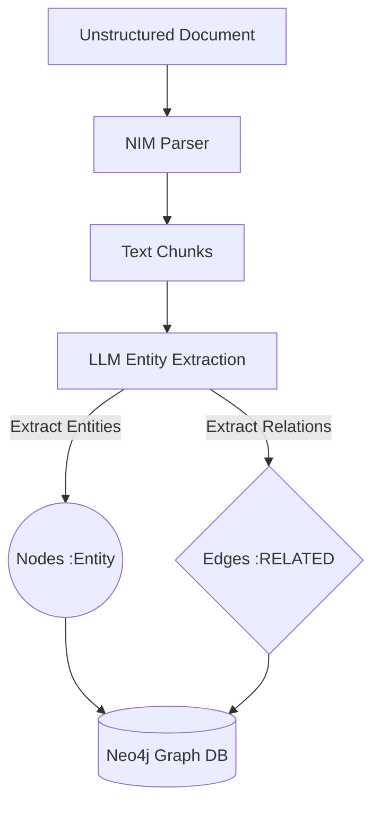

# Knowledge Graph Technical Guide

This document covers two distinct Knowledge Graph use cases in this system:

1. **Document Knowledge Graph** — entities extracted from uploaded PDFs/documents  
2. **USR Fraud Intelligence Graph** — the Unified Social Registry beneficiary graph for fraud detection

## Data Source Clarity (Important)

This repository has both **unstructured** and **structured** intelligence pipelines:

- **Unstructured pipeline (documents):**
  - source: uploaded PDFs/docs
  - modules: Research Chat, document Knowledge Map
  - purpose: semantic research and cross-document reasoning

- **Structured pipeline (social registry):**
  - source: a configured registry-source database restored into PostgreSQL beneficiary tables
  - modules: Social Registry Dashboard and USR fraud APIs
  - purpose: fraud intelligence, risk scoring, and audit prioritization

If a screen is USR fraud-focused, it is powered by **structured registry data**, not uploaded unstructured documents.

---

## Part 1: Document Knowledge Graph (Original)

### How it works



### Node/Edge Schema
```
(:Entity {name, type, document_ids[]})
    -[:RELATED {type, description, document_ids[]}]->
(:Entity)
```

Entity types: `Person`, `Organization`, `Location`, `Event`, `Concept`, `Document`

### Multi-Hop RAG
When a user queries, the system extracts entities from the question, finds their 1-hop and 2-hop neighbors in Neo4j, and adds those relationship insights to the LLM context window — enabling cross-document reasoning.

**See:** [`graph_db.py`](../backend/src/services/graph_db.py) → `search_multi_hop_context()`

> **Note:** The document Knowledge Map tab is only populated when PDFs are ingested and triplets extracted. If the graph contains only USR citizen data, the tab shows an empty graph (correct behavior — these are separate graphs).

---

## Part 2: USR Fraud Intelligence Knowledge Graph

### Purpose

The USR graph transforms a registry-source PostgreSQL dataset into a **fraud detection network** where fraud signals become first-class graph relationships — visible, traversable, and analyzable by the LLM.

### Why Graph over SQL?

| Problem | SQL approach | Graph approach |
|---|---|---|
| Duplicate detection | `JOIN ON name, dob` — misses fuzzy matches | `POTENTIAL_DUPLICATE` edge with confidence % |
| Ghost factories | `GROUP BY dob` — no cluster visualization | `SAME_DOB_AT_GP` cluster edge — visually obvious |
| Scheme concentration | `COUNT(*) / total` per GP | `HIGH_RISK_CLUSTER` edge on GP → Scheme |
| Agent-level fraud | Requires multi-table join chains | 2-hop traversal from any Citizen node |

---

### Node Schema

| Label | Key Properties |
|---|---|
| `Citizen` | `uid, name, dob, age, gender, risk_score (0–100), risk_tier, is_ghost_flag, is_dup_flag` |
| `GP` | `code, name, total_citizens, high_risk_pct` |
| `Block` | `code, name` |
| `District` | `code, name, avg_risk_score` |
| `Scheme` | `id, name, beneficiary_count` |
| `FraudFlag` | `rule, type (GHOST/DUPLICATE/ANOMALY/DATA_QUALITY), confidence, description` |

---

### Relationship Schema

#### Structural (always built during sync)
```cypher
(Citizen)-[:LIVES_IN]->(GP)
(GP)-[:PART_OF]->(Block)
(Block)-[:PART_OF]->(District)
(Citizen)-[:ENROLLED_IN]->(Scheme)
```

#### Fraud Signals (built by fraud batch)
```cypher
-- Exact duplicate: same name + DOB + GP
(Citizen)-[:POTENTIAL_DUPLICATE {confidence:92, rule:"B1", name_similarity:1.0}]->(Citizen)

-- Fuzzy duplicate: similar name + same DOB + GP
(Citizen)-[:POTENTIAL_DUPLICATE {confidence:78, rule:"B2", name_similarity:0.82}]->(Citizen)

-- DOB cluster: 5+ citizens share DOB at same GP
(Citizen)-[:SAME_DOB_AT_GP {dob, cluster_size, gp_code}]->(Citizen)

-- Ghost alert
(Citizen)-[:FLAGGED_AS {confidence:85}]->(FraudFlag {rule:"A1", type:"GHOST"})

-- Scheme concentration at GP
(GP)-[:HIGH_RISK_CLUSTER {scheme, concentration_ratio:0.23}]->(Scheme)
```

---

### Fraud Rules

| Rule | Trigger | Confidence | Edge Created |
|---|---|---|---|
| A1 | Age > 110 | 85% | `FLAGGED_AS → FraudFlag(GHOST)` |
| A2 | DOB in future | 90% | `FLAGGED_AS → FraudFlag(GHOST)` |
| B1 | Exact name+DOB+GP | 92% | `POTENTIAL_DUPLICATE` |
| B2 | Fuzzy name (≥80%) + DOB + GP | 78% | `POTENTIAL_DUPLICATE` |
| B3 | 5+ same DOB at GP | 70% | `SAME_DOB_AT_GP` |
| B4 | Cross-GP same name+DOB | 65% | `POTENTIAL_DUPLICATE` |
| C1 | GP > 15% of scheme enrollments (min 50 enrolled) | 70% | `HIGH_RISK_CLUSTER` |
| C3 | Enrollment before birth year | 80% | `FLAGGED_AS → FraudFlag(ANOMALY)` |
| D1 | Missing DOB | 60% | `FLAGGED_AS → FraudFlag(DATA_QUALITY)` |
| D3 | Duplicate scheme_beneficiary_id | 88% | `FLAGGED_AS → FraudFlag(DATA_QUALITY)` |

---

### LLM Assessment — Graph Context

When a citizen is assessed with AI (`GET /api/usr/assess/{uid}`), the system:
1. Fetches the citizen's **2-hop graph neighborhood** from Neo4j
2. Counts: duplicate edges, same-DOB neighbors, FraudFlag connections, GP risk stats
3. Formats everything into the structured assessment prompt
4. NVIDIA LLM returns: triggered rules, overall confidence %, recommendation, eligible schemes

**Recommendations:**
- `CLEAR` — < 30% confidence
- `MONITOR` — 30–59%
- `INVESTIGATE` — 60–79% (field verification within 30 days)
- `SUSPEND` — ≥80% (disbursement halt)

---

### Knowledge Map Visualization

Target USR visualization semantics:

**Node colors:**
- Citizen (LOW) → `#10b981` green
- Citizen (MODERATE) → `#f59e0b` amber
- Citizen (HIGH) → `#f97316` orange
- Citizen (CRITICAL) → `#ef4444` red + pulsing ring
- GP → `#3b82f6` blue diamond
- Block → `#6366f1` indigo hexagon
- District → `#8b5cf6` purple hexagon
- Scheme → `#06b6d4` cyan square
- FraudFlag → `#dc2626` red warning triangle

**Edge colors:**
- `LIVES_IN`, `PART_OF`, `ENROLLED_IN` → `#94a3b8` slate (structural)
- `POTENTIAL_DUPLICATE` → `#f59e0b` amber thick dashed
- `SAME_DOB_AT_GP` → `#ef4444` red thick solid (pulsing)
- `HIGH_RISK_CLUSTER` → `#dc2626` dark red very thick
- `FLAGGED_AS` → `#7f1d1d` dotted to FraudFlag node

---

### Implementation Status

As of April 20, 2026:

| Component | Status |
|---|---|
| Geographic hierarchy sync (`LIVES_IN`, `PART_OF`, `ENROLLED_IN`) | ✅ Done |
| Citizen node with risk score + tier | ✅ Done |
| Ghost flags in ai_analytics.py (PostgreSQL) | ✅ Done |
| Duplicate pairs in ai_analytics.py (PostgreSQL) | ✅ Done |
| **Fraud edges in Neo4j** (`POTENTIAL_DUPLICATE`, `SAME_DOB_AT_GP`) | ✅ Done |
| **FraudFlag nodes** in Neo4j | ✅ Done |
| **`HIGH_RISK_CLUSTER` GP→Scheme edges** | ✅ Done |
| **LLM prompt with graph context** | ✅ Done |
| **Knowledge Map USR visualization** | ⚠️ Partial (USR neighborhood endpoint exists; full dedicated USR map UX still evolving) |
| **`/api/usr/citizen/{uid}/graph-neighborhood`** endpoint | ✅ Done |

**Full design spec:** [`plan/usr_fraud_knowledge_graph_design.md`](../plan/usr_fraud_knowledge_graph_design.md)

---

## Part 3: Running the Graph Systems

### Document graph — triggered by document upload
```bash
# Documents are auto-ingested and triplets saved to Neo4j
# Knowledge Map tab shows entity graph when documents exist
```

### USR graph — triggered manually
```bash
# Step 1: Sync citizens from the configured registry source
curl -X POST "http://localhost:8081/api/usr/run-sync?limit=50000"

# Step 2: Run fraud batch (creates fraud edges in Neo4j)
curl -X POST "http://localhost:8081/api/usr/run-batch"

# Step 3: Check graph stats
curl http://localhost:8081/api/usr/graph-stats

# Step 4: Refresh Social Registry dashboard
# → Open browser → Social Registry tab → Click "Refresh Data"
```
