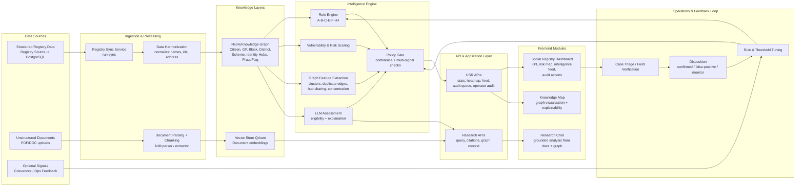

# Master Pipeline Flow Diagram

```mermaid
flowchart LR
  %% =========================
  %% DATA SOURCES
  %% =========================
  subgraph S1[Data Sources]
    A1[Structured Registry Data<br/>Registry Source -> PostgreSQL]
    A2[Unstructured Documents<br/>PDF/DOC uploads]
    A3[Optional Signals<br/>Grievances / Ops Feedback]
  end

  %% =========================
  %% INGESTION & PROCESSING
  %% =========================
  subgraph S2[Ingestion & Processing]
    B1[Registry Sync Service<br/>run-sync]
    B2[Document Parsing + Chunking<br/>NIM parser / extractor]
    B3[Data Harmonization<br/>normalize names, ids, address]
  end

  %% =========================
  %% KNOWLEDGE LAYERS
  %% =========================
  subgraph S3[Knowledge Layers]
    C1[Neo4j Knowledge Graph<br/>Citizen, GP, Block, District,<br/>Scheme, Identity Hubs, FraudFlag]
    C2[Vector Store Qdrant<br/>Document embeddings]
  end

  %% =========================
  %% INTELLIGENCE ENGINE
  %% =========================
  subgraph S4[Intelligence Engine]
    D1[Rule Engine<br/>A-B-C-E-F-H-I]
    D2[Vulnerability & Risk Scoring]
    D3[Graph Feature Extraction<br/>clusters, duplicate edges,<br/>hub sharing, concentration]
    D4[LLM Assessment<br/>eligibility + explanation]
    D5[Policy Gate<br/>confidence + multi-signal checks]
  end

  %% =========================
  %% API & APPLICATION
  %% =========================
  subgraph S5[API & Application Layer]
    E1[USR APIs<br/>stats, heatmap, feed,<br/>audit queue, operator audit]
    E2[Research APIs<br/>query, citations, graph context]
  end

  %% =========================
  %% FRONTEND EXPERIENCE
  %% =========================
  subgraph S6[Frontend Modules]
    F1[Social Registry Dashboard<br/>KPI, risk map, intelligence feed,<br/>audit actions]
    F2[Knowledge Map<br/>graph visualization + explainability]
    F3[Research Chat<br/>grounded analysis from docs + graph]
  end

  %% =========================
  %% OPERATIONS LOOP
  %% =========================
  subgraph S7[Operations & Feedback Loop]
    G1[Case Triage / Field Verification]
    G2[Disposition<br/>confirmed / false-positive / monitor]
    G3[Rule & Threshold Tuning]
  end

  %% Flows
  A1 --> B1 --> B3 --> C1
  A2 --> B2 --> C2
  A3 --> G3

  C1 --> D1
  C1 --> D2
  C1 --> D3
  C1 --> D4
  C2 --> E2

  D1 --> D5
  D2 --> D5
  D3 --> D5
  D4 --> D5

  D5 --> E1
  D4 --> E2

  E1 --> F1
  E1 --> F2
  E2 --> F3

  F1 --> G1 --> G2 --> G3 --> D1
  G3 --> D5
```
