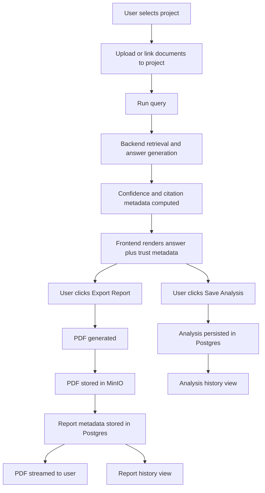
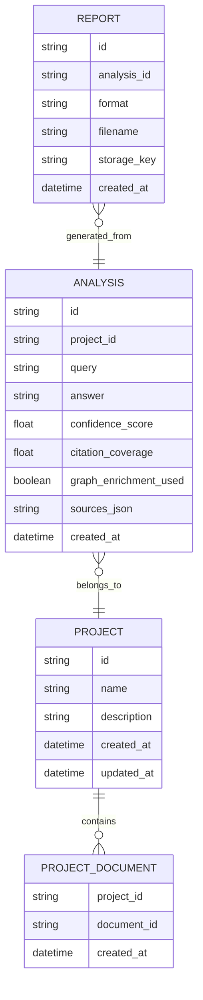
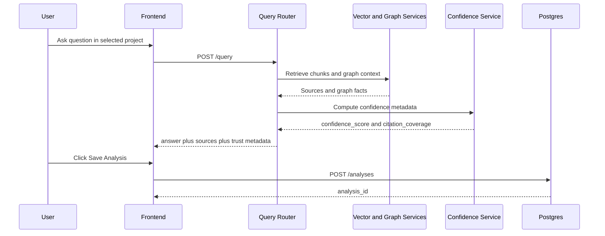
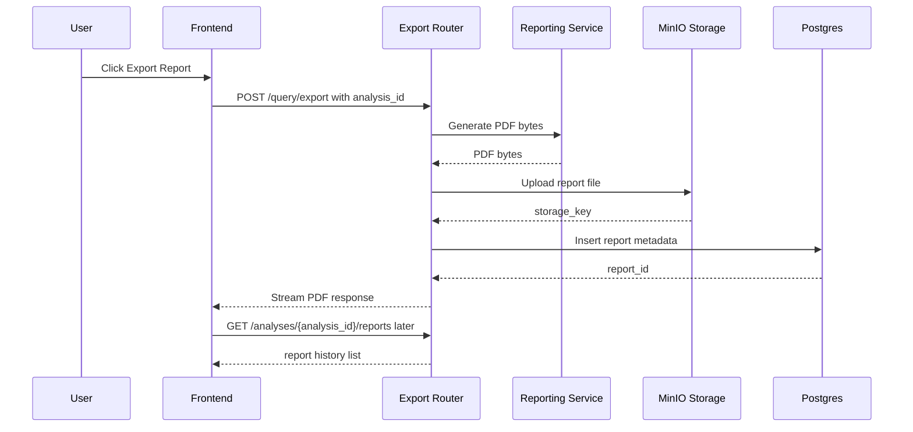
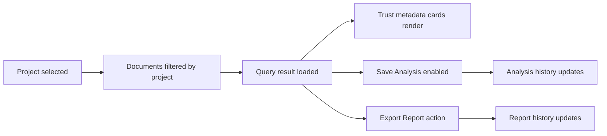
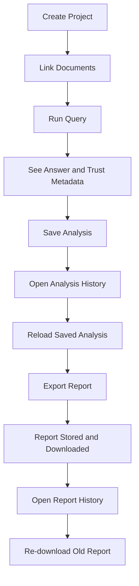

# Enterprise Batch 1 Implementation Plan

## Goal

Define the first implementation batch that moves Advance-Rag from a prototype workflow into a persistent enterprise workspace.

This batch focuses on the minimum high-value foundation:

- Projects
- Analyses
- Reports
- persistent save and reload flows
- trust metadata on answers
- project-aware frontend structure

## Batch 1 Scope

### Included

- `Project` data model and APIs
- `Analysis` data model and APIs
- `Report` data model and APIs
- report persistence after export
- save analysis flow from frontend
- analysis history view
- report history view
- confidence and citation metadata in query response
- project-aware application shell

### Excluded

These are intentionally deferred to later batches:

- auth and RBAC
- comments and pinned findings
- cross-document compare
- advanced graph provenance UI
- background workers
- SharePoint or external connectors
- task queue
- audit logs

## Batch 1 Outcome

After Batch 1, the platform must support this enterprise-safe user journey:

1. create a project
2. attach documents to the project
3. run a query in project context
4. inspect answer confidence and evidence quality
5. save the analysis
6. export a report from the analysis
7. reopen the analysis later
8. re-download old reports without regenerating them

## Primary System Flow



## No-Mistake Build Rules

To reduce implementation mistakes, follow these rules strictly:

- do not build frontend save/history UI before backend persistence APIs exist
- do not persist reports without first creating an `Analysis` record to attach them to
- do not add trust metadata to the frontend before the query API contract is finalized
- do not couple project creation with document upload in a single endpoint for Batch 1
- do not normalize `sources` into multiple tables yet; keep Batch 1 storage simple
- do not change existing document ingestion behavior unless required for project association
- do not add auth in Batch 1; use system-level placeholders only if needed

## Architecture Changes

### Backend

Add new models under `backend/src/models`:

- `project.py`
- `analysis.py`
- `report.py`

Add new routers under `backend/src/routers`:

- `projects.py`
- `analyses.py`
- `reports.py`

Add new services under `backend/src/services`:

- `analysis_service.py`
- `report_store.py`
- `confidence.py`

Update existing routers:

- extend `query.py` to return trust metadata
- update export flow to optionally persist generated reports

### Frontend

Refactor current app into feature sections:

- `src/components/projects`
- `src/components/analysis`
- `src/components/reports`
- `src/components/layout`

Targeted UI additions:

- project switcher
- project creation dialog
- save analysis action
- analysis history panel
- report history panel
- trust metadata summary cards

## Database Plan

### 1. Project Table

Purpose:
Group documents and analyses into reusable workspaces.

Fields:

- `id: str`
- `name: str`
- `description: Optional[str]`
- `created_at: datetime`
- `updated_at: datetime`

### 2. ProjectDocument Table

Purpose:
Map uploaded documents into a project workspace.

Fields:

- `project_id: str`
- `document_id: str`
- `created_at: datetime`

### 3. Analysis Table

Purpose:
Persist query runs and their outputs.

Fields:

- `id: str`
- `project_id: Optional[str]`
- `query: str`
- `answer: str`
- `confidence_score: Optional[float]`
- `citation_coverage: Optional[float]`
- `graph_enrichment_used: bool`
- `sources_json: str`
- `created_at: datetime`

Notes:

- `sources_json` can store the current source payload quickly for Batch 1
- later this can be normalized into a separate table if needed

### 4. Report Table

Purpose:
Track generated exports and make them re-downloadable.

Fields:

- `id: str`
- `analysis_id: str`
- `format: str`
- `filename: str`
- `storage_key: str`
- `created_at: datetime`

## Data Model Relationship Flow



## Backend API Contract

### Project APIs

#### `POST /projects`

Request:

```json
{
  "name": "KPMG Tax Review",
  "description": "Internal case workspace"
}
```

Response:

```json
{
  "id": "project_uuid",
  "name": "KPMG Tax Review",
  "description": "Internal case workspace",
  "created_at": "..."
}
```

#### `GET /projects`

Response:

```json
{
  "projects": [
    {
      "id": "project_uuid",
      "name": "KPMG Tax Review",
      "description": "Internal case workspace",
      "created_at": "..."
    }
  ]
}
```

#### `POST /projects/{project_id}/documents`

Request:

```json
{
  "document_ids": ["doc_1", "doc_2"]
}
```

Response:

```json
{
  "project_id": "project_uuid",
  "linked": 2
}
```

### Analysis APIs

#### `POST /analyses`

Request:

```json
{
  "project_id": "project_uuid",
  "query": "Summarize key risks",
  "answer": "...",
  "confidence_score": 0.84,
  "citation_coverage": 0.78,
  "graph_enrichment_used": true,
  "sources": []
}
```

Response:

```json
{
  "id": "analysis_uuid",
  "created_at": "..."
}
```

#### `GET /analyses`

Query params:

- `project_id` optional

Response:

```json
{
  "analyses": []
}
```

#### `GET /analyses/{analysis_id}`

Response:

```json
{
  "id": "analysis_uuid",
  "project_id": "project_uuid",
  "query": "...",
  "answer": "...",
  "confidence_score": 0.84,
  "citation_coverage": 0.78,
  "graph_enrichment_used": true,
  "sources": [],
  "created_at": "..."
}
```

### Report APIs

#### `GET /analyses/{analysis_id}/reports`

Response:

```json
{
  "reports": [
    {
      "id": "report_uuid",
      "filename": "Research_Report_123.pdf",
      "format": "pdf",
      "created_at": "..."
    }
  ]
}
```

#### `GET /reports/{report_id}/download`

Response:

- streaming PDF download

## Query API Extension

Extend the current `POST /query/` response with the following fields:

```json
{
  "query": "...",
  "answer": "...",
  "sources": [],
  "latency_ms": 1234,
  "confidence_score": 0.84,
  "citation_coverage": 0.78,
  "graph_enrichment_used": true,
  "weak_claims": []
}
```

## Query Request And Save Flow



## Confidence Logic For Batch 1

Keep the implementation simple and explainable.

### `confidence_score`

Initial heuristic inputs:

- rerank score quality of top chunks
- number of supporting chunks
- whether graph context was used
- answer length relative to evidence volume
- whether retrieval found sparse support

### `citation_coverage`

Initial heuristic:

- ratio of answer sections supported by at least one strong source
- start with coarse section-level estimation rather than sentence-level attribution

### `weak_claims`

Initial approach:

- empty array in Batch 1 if not enough time
- leave API field in place for future enrichment

## Report Persistence Flow

### Current flow

- frontend calls `/query/export`
- backend generates PDF and streams it back

### Batch 1 target flow

- frontend exports current analysis
- backend generates PDF
- backend stores PDF in MinIO
- backend inserts `Report` row in Postgres
- backend returns streamed PDF as today
- frontend can later fetch report history and re-download old reports

### Storage key convention

Use a deterministic report storage path:

- `reports/{analysis_id}/{report_id}.pdf`

## Report Export And Persistence Flow



## Frontend UI Plan

### 1. Project Shell

Add a project-aware shell in the left area:

- current project selector
- create project button
- selected project badge

### 2. Save Analysis

When query results are shown:

- show `Save Analysis` button
- store the current result under selected project

### 3. Analysis History Panel

Add a panel showing:

- previous analysis query
- timestamp
- confidence badge
- click to reload into the main result view

### 4. Report History Panel

Under each analysis or in a side drawer:

- list generated reports
- download past PDF
- show created timestamp

### 5. Trust Metadata Cards

Show near the answer header:

- confidence score
- citation coverage
- graph used yes or no

## Frontend State Flow



## Suggested File-Level Work

### Backend files to add

- `backend/src/models/project.py`
- `backend/src/models/analysis.py`
- `backend/src/models/report.py`
- `backend/src/routers/projects.py`
- `backend/src/routers/analyses.py`
- `backend/src/routers/reports.py`
- `backend/src/services/analysis_service.py`
- `backend/src/services/report_store.py`
- `backend/src/services/confidence.py`
- `backend/tests/test_projects.py`
- `backend/tests/test_analyses.py`
- `backend/tests/test_reports.py`

### Backend files to update

- `backend/src/models/__init__.py`
- `backend/src/main.py`
- `backend/src/routers/query.py`
- `backend/src/services/reporting.py`
- `backend/src/services/storage.py`

### Frontend files to add

- `frontend/src/components/projects/project-switcher.tsx`
- `frontend/src/components/projects/project-dialog.tsx`
- `frontend/src/components/analysis/analysis-history.tsx`
- `frontend/src/components/analysis/trust-metadata.tsx`
- `frontend/src/components/reports/report-history.tsx`

### Frontend files to update

- `frontend/src/App.tsx`
- optional supporting UI files as needed

## Safe Build Order

Implement in this exact sequence to reduce integration mistakes.

### Step 1. Backend Models

Build first:

- `Project`
- `ProjectDocument`
- `Analysis`
- `Report`

Do not move to routers before tables are defined and imported.

### Step 2. Backend Routers

Build next:

- project create and list
- project document linking
- analysis save and get
- report list and download

Do not build frontend history panels before these endpoints return stable JSON.

### Step 3. Report Persistence

Only after `Analysis` and `Report` models exist:

- attach export requests to an existing `analysis_id`
- upload report to MinIO
- save report metadata

Do not persist reports without an analysis association.

### Step 4. Query Trust Metadata

Once query schema is stable:

- add confidence service
- add query response metadata fields
- keep heuristics simple and deterministic

Do not change answer generation prompts at the same time unless required.

### Step 5. Frontend Project Context

Build after project APIs are stable:

- project selector
- create project dialog
- selected project context state

### Step 6. Frontend Analysis Save And History

Build after analysis APIs are stable:

- save analysis button
- analysis history panel
- reload saved analysis into result area

### Step 7. Frontend Report History

Build after report persistence is working:

- list historical reports
- re-download report

### Step 8. Final Verification

Run manual flow end to end and only then proceed to Batch 2.

## Testing Plan

### Backend tests

Add tests for:

- create project
- list projects
- save analysis
- list analyses by project
- persist report metadata
- download persisted report
- confidence metadata presence in query response

### Frontend verification

Manual verification path:

1. create a project
2. upload documents into project
3. run a query
4. confirm trust metadata renders
5. save analysis
6. reload saved analysis
7. export report
8. confirm report appears in history
9. re-download saved report

## End-To-End Acceptance Flow



## Definition Of Done

Batch 1 is complete only when:

- a project can be created and selected
- an analysis can be saved and reopened
- a report can be exported and later re-downloaded
- trust metadata appears in query results
- project context is visible in the UI
- backend tests cover new models and routes
- the full end-to-end acceptance flow works without manual database fixes

## Immediate Next Coding Task

Start with backend foundations first:

1. add the three core SQLModel tables plus project-document mapping
2. register them in imports and startup
3. add project CRUD routes
4. add analysis save and fetch routes
5. add report persistence in export route

Once that is stable, move to frontend integration.
