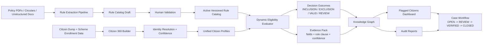
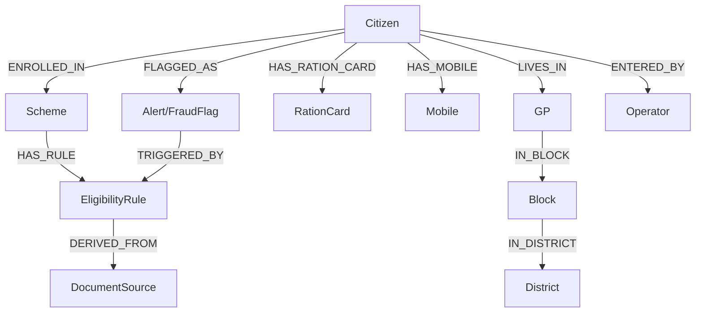
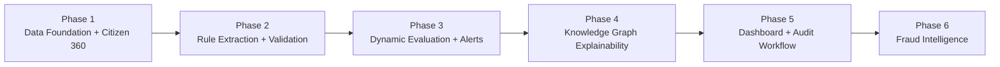

# High-Level Plan: Dynamic Scheme Eligibility, Inclusion/Exclusion, and Knowledge Graph Intelligence

## 1. Vision
Build a dynamic decision system that can continuously read policy documents, convert them into machine-usable rules, evaluate every citizen against every relevant scheme, and surface explainable inclusion/exclusion alerts through a knowledge graph and audit dashboard.

## 2. Problem We Are Solving
Current welfare evaluation typically fails in three areas:
1. Rules are hardcoded and cannot keep up with policy changes.
2. Citizen identity across datasets is inconsistent.
3. Alerts are not explainable to field teams, auditors, or layman users.

Target outcome:
- Detect wrong inclusion (enrolled but not eligible).
- Detect wrong exclusion (eligible but not enrolled).
- Provide evidence-backed, auditable, visual decisions.

## 3. High-Level Solution Strategy

### A. Dynamic Rule Intelligence Layer
- Ingest policy PDFs and unstructured circulars.
- Extract eligibility criteria into structured rule definitions.
- Maintain rule versions with effective dates.
- Human validation gate before a rule becomes active.

### B. Citizen Identity and Data Unification Layer
- Build Citizen 360 profile from dump and scheme datasets.
- Resolve identity using deterministic + probabilistic matching.
- Track match confidence and route uncertain cases to manual review.

### C. Decision Engine Layer
- Evaluate active rule catalog dynamically (no scheme-specific hardcoding).
- Compare expected eligibility vs actual enrollment.
- Emit outcomes: `INCLUSION_ERROR`, `EXCLUSION_ERROR`, `VALID`, `REVIEW_REQUIRED`.
- Store full evidence payload per decision.

### D. Knowledge Graph + Explainability Layer
- Model entities and their relationships for end-to-end transparency.
- Generate graph-based red/orange/green alert views.
- Enable drill-down from alert -> rule -> source document -> evidence fields.

### E. Audit and Operations Layer
- Push flagged citizens into dashboard queue.
- Support case lifecycle: `OPEN -> UNDER_REVIEW -> VERIFIED -> CLOSED/ESCALATED`.
- Generate citizen-level and program-level audit reports.

## 3.1 Base Architecture Diagram (Mermaid)

## 4. How We Generate the Solution (Execution Blueprint)
1. Define canonical data model and schema contracts.
2. Build rule extraction pipeline from PDF to structured rule JSON.
3. Build rule governance workflow (draft, validate, activate, retire).
4. Build citizen identity resolution pipeline and confidence scoring.
5. Build generic eligibility evaluator against rule catalog.
6. Build contradiction/conflict engine (scheme conflict matrix as data).
7. Persist decisions and evidence into graph + alert store.
8. Build dashboard for triage, filtering, and report export.
9. Add feedback loop from audit decisions to tune rule precision.

## 5. How Knowledge Graph Helps (Core Value)
Knowledge graph is the system’s trust and intelligence backbone:

1. Relationship clarity
- Connects citizens, schemes, rules, documents, operators, and alerts in one model.
- Makes hidden conflicts visible (for example, contradictory enrollments).

2. Explainability
- Every alert can show exact rule, source clause, and evidence fields.
- Non-technical users can understand why a citizen was flagged.

3. Cross-scheme intelligence
- Detects multi-scheme contradictions and network-level anomalies.
- Supports temporal reasoning using enrollment dates and rule validity windows.

4. Audit readiness
- Preserves provenance: who entered data, which rule version decided outcome, when flag was raised.
- Enables reproducible investigations and defensible governance.

5. Future fraud detection foundation
- Inclusion/exclusion alerts become high-quality signals for fraud models.
- Graph structure enables ring detection, concentration anomalies, and identity reuse patterns.

## 5.1 Knowledge Graph Relationship Diagram (Mermaid)

## 6. Target High-Level Graph Model

### Nodes
- `Citizen`, `Scheme`, `EligibilityRule`, `DocumentSource`, `FraudFlag/Alert`, `RationCard`, `Mobile`, `GP`, `Block`, `District`, `Operator`

### Key Edges
- `Citizen-ENROLLED_IN->Scheme`
- `Scheme-HAS_RULE->EligibilityRule`
- `EligibilityRule-DERIVED_FROM->DocumentSource`
- `Citizen-FLAGGED_AS->Alert`
- `Citizen-HAS_RATION_CARD->RationCard`
- `Citizen-HAS_MOBILE->Mobile`
- `Citizen-LIVES_IN->GP->Block->District`
- `Citizen-ENTERED_BY->Operator`

## 7. Phased Rollout
1. Phase 1: Data foundation + Citizen 360 + identity confidence.
2. Phase 2: Rule extraction + validation + versioned rule catalog.
3. Phase 3: Dynamic evaluator + inclusion/exclusion alerts.
4. Phase 4: Knowledge graph explainability + contradiction queries.
5. Phase 5: Audit dashboard + case workflow + reporting.
6. Phase 6: Fraud intelligence models on top of verified alert history.

## 7.1 Phase Timeline Diagram (Mermaid)

## 8. Key Risks and Controls
1. Rule extraction errors from unstructured documents.
- Control: human validation and rule version governance.

2. Identity mismatch causing false flags.
- Control: confidence thresholds and manual review path.

3. Policy changes invalidating old decisions.
- Control: effective date versioning and re-evaluation jobs.

4. User trust issues due to opaque alerts.
- Control: mandatory evidence, provenance, and plain-language explanation.

## 9. Success Metrics
- Inclusion precision (true positive rate after audit).
- Exclusion recall (eligible missed citizens correctly found).
- % alerts with complete evidence and source provenance.
- Median audit closure time.
- Reduction in false positives over iterations.

## 10. Final Outcome
A dynamic, policy-aware, explainable welfare intelligence platform where:
- rules adapt as schemes evolve,
- graph intelligence reveals contradictions clearly,
- auditors get actionable case queues,
- and governance teams get defensible, transparent decisions.
