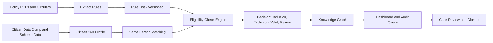

# Layman Plan: How We Check Scheme Eligibility, Find Mistakes, and Audit Safely

## 1. Simple Problem Statement
Right now, government scheme data can have two major mistakes:
- A person gets a scheme they should not get (wrong inclusion).
- A person who should get a scheme is missing (wrong exclusion).

Why this matters:
- Wrong people may receive benefits.
- Eligible people may be left out.
- Manual checking is slow and confusing.

Our goal is to build a clear system that checks this automatically and explains every decision in plain language.

## 2. End-to-End Approach (Simple Flow)

### Step-by-step
1. Read scheme rules from PDF/circular documents.
2. Convert those rules into a structured format the system can use.
3. Combine citizen records from the data dump into one clean profile per person.
4. Make sure records across schemes belong to the same person (using ration card, DOB, etc.).
5. Compare each citizen with each scheme rule.
6. Mark result as:
   - `INCLUSION_ERROR` (wrongly included)
   - `EXCLUSION_ERROR` (wrongly excluded)
   - `VALID` (correct)
   - `REVIEW_REQUIRED` (needs human check)
7. Show all flagged cases in dashboard and knowledge graph.
8. Let audit team review and close cases.

### Diagram

## 3. How Knowledge Graph Helps (in Plain Language)
Knowledge graph is like a connected map of people, schemes, rules, and alerts.

It helps because:
- You can quickly see who is connected to what scheme.
- You can spot contradictions across multiple schemes.
- Each red flag can show: which rule failed, what evidence was used, and from which document rule came.
- Investigators can understand the case without reading raw database tables.

In short: the graph makes the system transparent and easy to explain.

## 4. Dashboard and Audit Offerings

### What dashboard will show
- Total cases checked.
- Total wrong inclusions.
- Total wrong exclusions.
- Cases waiting for manual review.
- Filters by district, block, GP, scheme, and rule.

### What audit team can do
- Open a case.
- Review evidence and rule.
- Mark as verified/closed/escalated.
- Add notes and actions.

### Reports we can generate
- Citizen-level report: why this person was flagged.
- Summary report: which schemes/areas have more issues.
- Trend report: whether mistakes are reducing over time.

## 5. Data Sovereignty (Simple Meaning: Data Safety + Control)
Data sovereignty means citizen data must stay protected and used only for approved purpose.

Main safeguards:
- Keep data in approved environment/location.
- Give access only to authorized roles.
- Mask sensitive data in dashboard when not needed.
- Keep full logs of who viewed/changed what.
- Track which rule version made each decision.
- Keep data only for required period; delete safely after that.

Why this is important:
- Protects citizens.
- Builds trust.
- Keeps system compliant for government audit.

## 6. Final Expected Outcome
A clear and reliable welfare intelligence system where:
- policy changes can be handled quickly,
- wrong inclusion/exclusion is detected early,
- every flag is explainable,
- audit teams can take action faster,
- and citizen data remains secure and well-governed.
