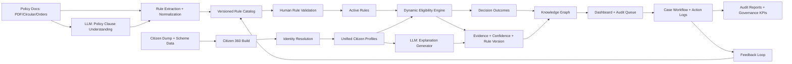

# Senior-Level Plan: Dynamic Eligibility, Knowledge Graph, Audit, and Data Governance

## 1. Overview Problem Statement
Public welfare delivery systems face a structural challenge: policy rules change frequently, while citizen data is fragmented across multiple systems. This creates two high-impact errors:
- Inclusion error: citizen enrolled in a scheme despite failing active eligibility rules.
- Exclusion error: citizen eligible for a scheme but not enrolled.

Business impact:
- Leakage, policy non-compliance, and weak trust in scheme governance.
- Manual audits that are slow, non-repeatable, and hard to explain.

Strategic objective:
- Build a dynamic, policy-aware decision platform that continuously converts scheme documents into rules, evaluates citizens at scale, and provides explainable, auditable outcomes.

## 2. End-to-End Approach (with Diagram)

### 2.1 Operating Model
1. Ingest unstructured policy inputs (PDF/circular/notifications).
2. Use LLM to read and interpret policy clauses from unstructured text.
3. Extract and normalize eligibility rules into versioned machine-readable catalog.
4. Build Citizen 360 from data dump and enrollment sources.
5. Resolve identity across records (deterministic + probabilistic confidence).
6. Evaluate each citizen against active rules dynamically.
7. Use LLM to generate plain-language explanations for decisions and evidence.
8. Generate outcome alerts (`INCLUSION_ERROR`, `EXCLUSION_ERROR`, `VALID`, `REVIEW_REQUIRED`).
9. Persist all outcomes, evidence, and provenance in knowledge graph.
10. Surface flagged cases in dashboard with audit workflow.
11. Feed verified audit outcomes back into rule quality and threshold tuning.

### 2.2 End-to-End Base Architecture

### 2.3 Decision Principles
- No hardcoded scheme logic; all scheme behavior comes from rule catalog.
- Every decision must be reproducible using rule version + evidence bundle.
- Low-confidence identity links must move to manual review, not auto-flag.
- LLM is used for policy interpretation and plain-language explanation, not as the final authority for rule activation.

## 3. Knowledge Graph Merits
Knowledge graph is the intelligence and trust layer of the system.

### 3.1 Why KG is critical
- Unifies entities and relationships across silos (citizen, scheme, rule, source, operator, location).
- Captures cross-scheme contradictions that row-based tables miss.
- Enables explanation path: alert -> rule -> source clause -> citizen evidence.
- Supports temporal context (rule effective windows, enrollment timelines).
- Improves fraud and anomaly detection readiness through network signals.

### 3.2 Core graph value outcomes
- Explainability for non-technical and audit users.
- Faster investigation through relationship traversal.
- Reduced false positives via context-rich checks.
- Strong provenance for legal and compliance reviews.

## 4. Dashboard Audit Offerings

### 4.1 Operational Dashboard
- KPI cards: total evaluated, inclusion errors, exclusion errors, review backlog.
- Filtering: district/block/GP/scheme/rule/confidence/time window.
- Risk list: prioritized flagged citizens with severity and confidence.
- Graph drill-down: 1-click relationship view for a selected case.

### 4.2 Audit Workflow
- Case states: `OPEN -> UNDER_REVIEW -> VERIFIED -> CLOSED / ESCALATED`.
- Assignment and SLA tracking by operator/team.
- Mandatory resolution notes with evidence attachment.
- Immutable action logs for each case action.

### 4.3 Report Offerings
- Citizen-level audit sheet: violation reason, evidence, rule reference, suggested action.
- Program-level summary: error rates by geography/scheme/rule.
- Trend analytics: recurring contradiction patterns and resolution efficiency.
- Export-ready views for governance and compliance stakeholders.

## 5. Data Sovereignty Issues

### 5.1 Key Sovereignty Risks
- Unauthorized access to PII/sensitive welfare attributes.
- Cross-boundary data transfer without policy controls.
- Rule and decision opacity leading to accountability gaps.
- Over-retention of personal data beyond legal need.
- Weak lineage preventing verification of source and consent context.

### 5.2 Governance Controls
- Data residency controls: keep data in approved jurisdiction and infrastructure boundary.
- Purpose limitation: use citizen data only for defined welfare decision purposes.
- Role-based and attribute-based access controls for investigators, auditors, and admins.
- Encryption: at rest and in transit; key management with rotation policy.
- Data minimization and masking in UI/export based on user role.
- Rule and decision lineage: store source document, rule version, decision timestamp.
- Retention and deletion policy aligned to legal and departmental mandates.
- Auditability: immutable logs of data access, rule changes, and case actions.

### 5.3 Compliance-by-Design Requirements
- Policy versioning and impact replay before new rules go live.
- Human-in-the-loop checkpoints for high-impact decisions.
- Explainable outcomes as mandatory control for any citizen-facing action.
- Periodic governance review: false positives, access anomalies, and model/rule drift.

## 6. Executive Outcome
A resilient decision platform where policy changes are absorbed quickly, eligibility decisions remain explainable, audits are operationally efficient, and data sovereignty obligations are built into the architecture rather than treated as afterthoughts.
