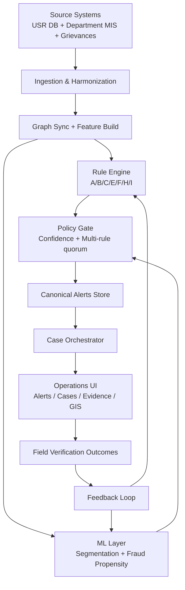
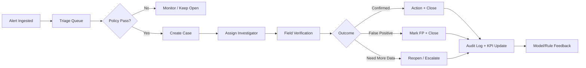

# USR Production Upgrade Plan (Backend + Frontend)

## Goal

Transform the current Unified Social Registry (USR) implementation into a production-grade intelligence platform with:

- reliable fraud detection and case management
- explainable and auditable decisions
- near-real-time updates
- scalable frontend operations workflows
- strong security, observability, and release safety

---

## 1) Current Baseline (What Exists)

### Backend already in place

- Graph sync from the registry source to Neo4j (`run-sync`)
- Batch intelligence run with rules A/B/C/E/F/H/I (`run-batch`)
- Vulnerability scoring and risk tier assignment
- USR APIs for stats, heatmap, top-risk, intelligence feed, audit queue, operator audit, graph neighborhood
- LLM-assisted eligibility assessment endpoint

### Frontend already in place

- USR dashboard with KPIs, district risk chart, intelligence feed, audit queue modal, operator drilldown, CSV/PDF export

### Known production gaps

- alert contract inconsistency across endpoints/UI sections
- dashboard totals mismatch with full rule coverage
- manual/batch-heavy operation rather than event/incremental
- no full case lifecycle workflow
- limited automated test coverage for USR flow
- missing enterprise-grade authz/auditing/operability

---

## 2) Target Production Architecture

### Core principles

- one canonical alert model across all backend and frontend paths
- deterministic rule engine + ML assist layer (hybrid intelligence)
- event/incremental processing for freshness
- case workflow with audit trail and SLA tracking
- strong explainability and data lineage per alert

### High-level layers

1. Ingestion and harmonization
2. Graph enrichment and feature computation
3. Intelligence engine (rules + ML + policy gate)
4. Alert and case orchestration
5. Operations UI and analytics
6. Monitoring, security, and governance

### End-to-end production flow

---

## 3) Canonical Data Contracts

### 3.1 Canonical `Alert` schema (new)

All rule outputs must be mapped into one schema.

Required fields:

- `alert_id` (uuid)
- `subject_type` (`citizen` | `operator` | `ration_card` | `gp` | `scheme`)
- `subject_id`
- `rule_id` (`A1`, `B2`, `F1`, etc.)
- `rule_family` (`ghost`, `duplicate`, `anomaly`, `data_quality`, `internal`, `exploitation`)
- `confidence` (0-100)
- `severity` (`low` | `moderate` | `high` | `critical`)
- `status` (`new` | `triaged` | `assigned` | `verified` | `false_positive` | `closed`)
- `evidence` (structured JSON with graph facts)
- `detected_at`
- `run_id`
- `version`

Optional fields:

- `recommended_action`
- `geo_scope` (district/block/gp)
- `assignee`
- `sla_due_at`

### 3.2 Canonical `Case` schema (new)

- `case_id`
- `primary_alert_id`
- `linked_alert_ids[]`
- `priority`
- `owner`
- `status`
- `resolution_type`
- `resolution_notes`
- `created_at`, `updated_at`, `closed_at`

### 3.3 API response contract standards

All endpoints return:

- `data`
- `meta` (pagination, totals, filters, version)
- `trace_id`
- typed `error` structure on failure

---

## 4) Backend Work Plan

## Phase A: Hardening and Consistency

### A1. Config and secrets cleanup

- remove all hardcoded DB credentials in services
- route all config through `pydantic Settings` + `.env`
- ensure URL-encoded password handling for infra DSNs

### A2. Query safety and validation

- parameterize Cypher/SQL everywhere
- add strict request models for all `/api/usr/*` endpoints
- enforce range checks for `limit`, paging, thresholds

### A3. Alert pipeline unification

- create `alerts` table or graph-backed alert projection
- refactor rule outputs to emit canonical `Alert`
- update current feed/audit/export endpoints to use same source

### A4. Reliability fixes

- idempotent run keys (`run_id`) for batch/sync jobs
- add retry + timeout + structured error logs
- fix dead/unreachable fallback logic in router endpoints

---

## Phase B: Case Management and Policy Engine

### B1. Decision policy gate

- configurable policy:
  - minimum confidence
  - minimum independent rule count
  - severity escalation matrix
- output action class: `monitor`, `investigate`, `suspend_recommended`

### B2. Case lifecycle APIs

New endpoints:

- `POST /api/usr/cases`
- `GET /api/usr/cases`
- `GET /api/usr/cases/{id}`
- `PATCH /api/usr/cases/{id}`
- `POST /api/usr/cases/{id}/assign`
- `POST /api/usr/cases/{id}/close`

### B3. Audit trail

- immutable event log for every state transition
- actor, timestamp, action, before/after snapshot

---

## Phase C: Near-Real-Time Intelligence

### C1. Incremental processor

- detect changed/new records from source (watermark or CDC pattern)
- recompute only impacted graph neighborhoods
- partial rule recomputation for impacted hubs

### C2. Scheduling model

- full batch nightly
- incremental every N minutes
- emergency backfill command

### C3. Consistency guarantees

- exactly-once semantics at alert projection level
- dedup keys for repeated detections

---

## Phase D: ML and NLP expansion

### D1. ML segmentation

- clustering for lifecycle/vulnerability segments
- persist segment labels and confidence
- use segment in UI filtering and intervention planning

### D2. ML fraud propensity

- feature store from graph + tabular stats
- model score in parallel with rules
- score only influences priority at first (shadow/challenger mode)

### D3. Grievance intelligence

- ingest grievance text/call transcripts/social signals
- NLP classification: fraud, delay, exclusion, corruption
- sentiment/urgency extraction
- feedback signal into alert prioritization

---

## 5) Frontend Production Plan

## Phase E: Operations Console Upgrade

### E1. New UI information architecture

- `Dashboard` (executive KPIs)
- `Alerts` (searchable canonical queue)
- `Cases` (workflow board)
- `Graph Evidence` (entity neighborhood explainability)
- `Operations` (runs, health, SLA)

### E2. Alerts workspace

- server-side filters: rule, severity, status, district, date range
- stable sort + pagination + virtualized table
- bulk actions: assign, status update, export
- quick insight cards tied to same API totals

### E3. Case detail view

- timeline of actions
- linked evidence panel
- recommendation breakdown (rules + ML)
- field verification checklist
- attach notes/artifacts

### E4. Explainability UX

- per-alert “Why flagged?” section
- confidence decomposition
- graph path summary
- contradictory signals warning (if present)

### Alert-to-case lifecycle flow

---

## Phase F: Geo and Accessibility Improvements

### F1. Real GIS layer

- district/block/gp map overlay
- hotspot shading by severity/alert density
- click-to-filter into alerts/cases

### F2. UX resilience and performance

- typed API clients
- optimistic updates for assignments/status
- retry/backoff with visible failure states
- skeleton states and empty-state guidance

### F3. Accessibility and operator readiness

- keyboard navigation for case operations
- AA contrast compliance
- readable audit print/PDF templates

---

## 6) Data, Infra, and DevOps

### 6.1 Storage strategy

- source truth for entities in Postgres + Neo4j for graph intelligence
- persistent alert/case store in Postgres for transactional workflows
- graph remains evidence/computation layer

### 6.2 Jobs and orchestration

- background workers for sync/intelligence runs
- job state table with retry counts and run metrics
- run cancellation and rerun capability

### 6.3 Observability

- metrics:
  - alert volume by rule/severity
  - job duration and failure rate
  - API p95 latency/error rate
  - case SLA breaches
- distributed trace with `trace_id` surfaced in UI
- alerting for stale pipelines and queue spikes

---

## 7) Security and Governance

### 7.1 Access control

- role-based permissions:
  - admin
  - auditor
  - reviewer
  - viewer

### 7.2 PII handling

- mask sensitive fields by role
- secure export policies
- signed audit logs for forensic trust

### 7.3 Compliance controls

- field-level access logs
- retention + archival policy
- change-control for scoring thresholds and rule configs

---

## 8) Testing Strategy (Production Gate)

### 8.1 Backend tests

- unit tests for each rule detector
- contract tests for all USR APIs
- integration tests for sync + batch + incremental runs
- policy-gate tests (multi-rule threshold behavior)

### 8.2 Frontend tests

- component tests for alerts/cases/filters
- e2e critical flows:
  - alert triage
  - case assignment
  - case closure
  - export

### 8.3 Load and resilience tests

- large alert queue rendering and pagination
- batch/incremental overlap behavior
- recovery drills (worker restart, partial failure)

---

## 9) Rollout Plan

## Stage 1 (Weeks 1-2): Hardening

- config/security cleanup
- query parameterization
- canonical alert contract introduced
- frontend totals aligned to canonical source

Exit criteria:

- no hardcoded secrets
- consistent alert counts across all screens/exports
- passing test baseline for USR APIs

## Stage 2 (Weeks 3-4): Workflow

- case lifecycle APIs
- frontend alerts and cases workspace
- assignment and triage flows

Exit criteria:

- end-to-end triage-to-closure works with audit trail

## Stage 3 (Weeks 5-7): Freshness

- incremental intelligence pipeline
- run observability dashboard

Exit criteria:

- freshness SLA achieved
- no duplicate alerts on repeated runs

## Stage 4 (Weeks 8-10): Intelligence expansion

- ML segmentation + propensity scoring (shadow mode)
- grievance NLP ingestion and tagging

Exit criteria:

- model outputs visible with explainability
- no policy action solely dependent on opaque model

## Stage 5 (Weeks 11-12): GIS + Production Readiness

- full geospatial layer
- perf/security/reliability gate
- release checklist and runbooks

Exit criteria:

- production SLOs met
- operations team sign-off

---

## 10) KPIs for Success

### Detection quality

- precision at top-K reviewed alerts
- false-positive rate after field verification
- proportion of multi-signal cases

### Operations

- mean time to triage
- mean time to close
- SLA breach rate

### Platform

- API p95 latency
- job success rate
- data freshness lag

### Product adoption

- weekly active auditors/reviewers
- cases closed per analyst
- explainability panel usage

---

## 11) Immediate Next Sprint (Actionable)

1. Implement canonical `Alert` schema and migrate `/intelligence/feed`, `/audit-queue`, CSV/PDF export.
2. Add decision gate policy and expose gate result in API.
3. Build frontend Alerts table using server filters + pagination.
4. Add case creation/assignment/closure endpoints and UI.
5. Add focused tests for rules + APIs + one e2e triage flow.

This gives the fastest path from “advanced prototype” to “operational production platform.”
